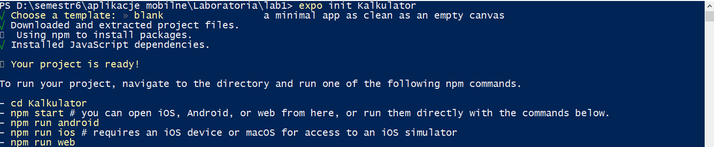
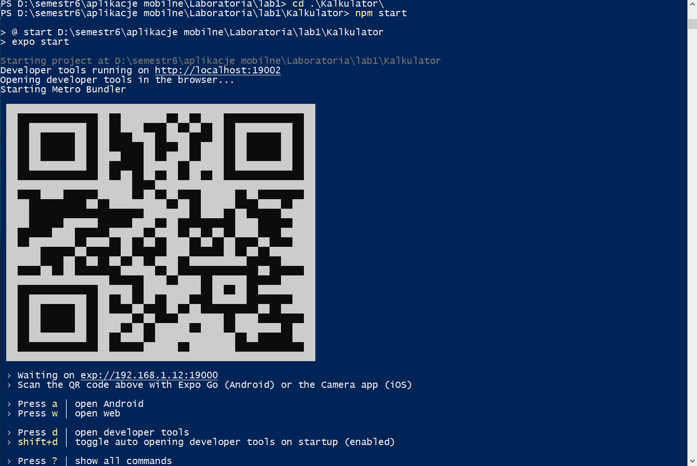
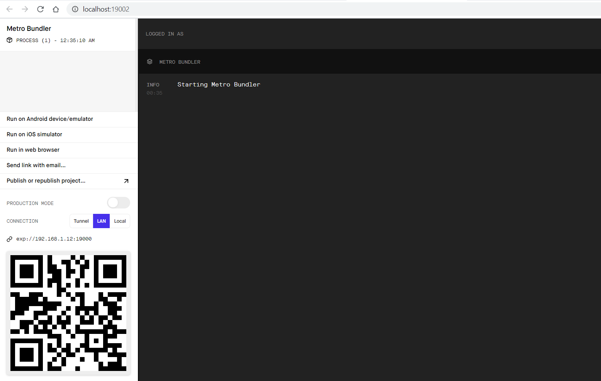
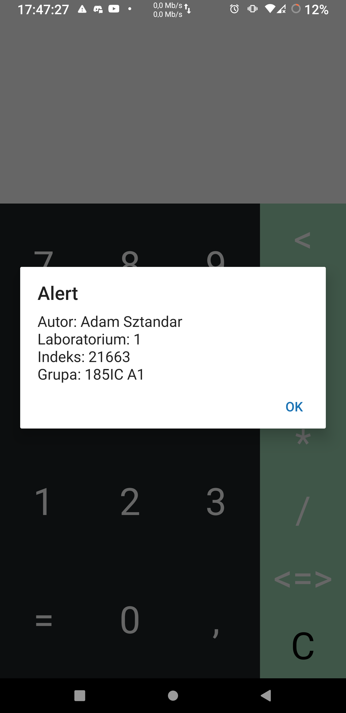
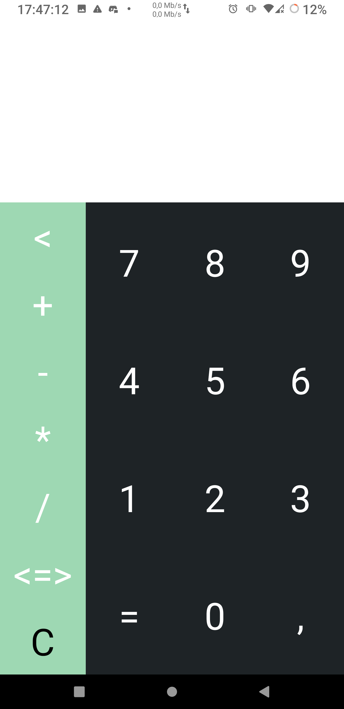
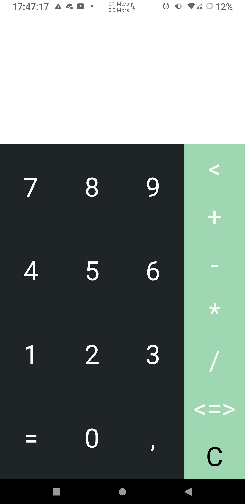
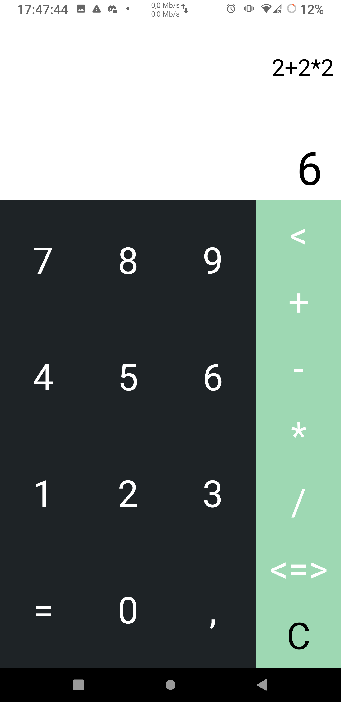

# Lab1 - Kalkulator

## Wykorzystane technologie:
* React NAtive
* Expo


## Opis zadania:
poniższe zagadnienia powinny zostać zrealizowane:  
* dla wybranej technologii: instalacja pakietów i tworzenie projektu, ustawienia projektu, korzystanie z serwera deweloperskiego,  
* wykorzystanie podstawowych komponentów i API dla wybranej technologii, np. dla React Native,  
* zapoznanie z komponentami dla wybranej technologii i ich użycie, np. dla React Native,

### Zadanie - "dla wybranej technologii: instalacja pakietów i tworzenie projektu, ustawienia projektu, korzystanie z serwera deweloperskiego" :

1. Instalujemy NodeJS + npm.
2. Instalujemy Expo - komenda:&nbsp; ```npm install expo-cli –global ```
3. Przechodzimy do folderu w którym chcemy utworzyć projekt.
4. Tworzymy projekt korzystając z CLI - komenda:&nbsp; ```expo init <nazwa_aplikacji>```
5. Wybieramy szablon (w moim przypadku "blank").
6. Następnie możemy (w celach testowych) uruchomić nasz projekt:  
6.1. Przechodzimy do katalogu z projektem.  
6.2. Uruchamiamy Expo - komenda:&nbsp; ```npm start```  

__Wiersz poleceń__  
  
 
  

__Przeglądarka__  
  


## Opis kodu:
```javascript
import React, { Component } from "react";
import {
  StyleSheet,
  Text,
  View,
  TouchableOpacity,
} from "react-native";
```
StyleSheet - komponent podobny do arkusza styli CSS  
Text - komponent do zagnieżdżania tekstu  
View - komponent pełniący rolę kontenera (jak div)
TouchableOpacity - prawidłowa obsługa reakcji na dotyk

<br/>
<br/>
<br/>

```javascript
constructor() {
    super();
    this.forceUpdateHandler = this.forceUpdateHandler.bind(this);
    this.state = {
      operationsText: "",
      resultText: "",
    };
    this.operations = ["<", "+", "-", "*", "/","<=>","C"];
    this.handP = true;
  }
```
Widzimy tutaj konstruktor. Przypisujemy wartości początkowe zmiennych. 

<br/>
<br/>
<br/>

```javascript
forceUpdateHandler(){
    this.forceUpdate();
  };
```
Funkcja wykorzystywana do odświeżenia aplikacji (korzystam z niej jak chcę przenieść panel operatorów z lewej na prawą stronę i odwrotnie)

<br/>
<br/>
<br/>

```javascript
  calculationResult() {
    const text = this.state.operationsText;
    this.setState({
      resultText: eval(text),
    });
  }
```
Funkcja wywoływana przy naciśnięciu przycisku "=". Przypisuje zmiennej resultText wynik działania z operationsText

<br/>
<br/>
<br/>

```javascript
validate() {
    const text = this.state.operationsText;
    switch (text.slice(-1)) {
      case "+":

      case "-":

      case "*":

      case "/":
        return false;
    }
    return true;
  }
```
Walidacja znaku operacyjnego.

<br/>
<br/>
<br/>

```javascript
handlePressButton(text) {
    if (text == "=") {
      return this.validate() && this.calculationResult(this.state.operationsText);
    }

    this.setState({
      operationsText: this.state.operationsText + text,
    });
    if(this.state.operationsText + text == "21663") {
      alert("Autor: Adam Sztandar\nLaboratorium: 1\nIndeks: 21663\nGrupa: 185IC A1");
      this.setState({
        operationsText: ""
      });
    }
  }
```
Obsługa zdarzenia naciśnięcia dowolnego przycisku cyfry (lub przecinka)  
Dodałem dodatkowo akcję po wprowadzeniu liczby: **21663**  
Jest to numer mojego indeksu i po wprowadzeniu go wyświetlą się dane odnoścnie autora. Jest to jedynie forma zabawy z kodem.
Sprawdzam czy naciśnięty został przycisk "=" jak tak to wykonuje dwie metody opisane wyżej.  
Dopisuje wprowadzony znak do tekstu.  
Sprawdzam czy wprowadzone liczby mają postać 21663 jak tak to wyświetlam alert.  
  

<br/>
<br/>
<br/>

```javascript
operate(operation) {
    switch (operation) {
      case "<=>":
        this.handP = (!this.handP)
        console.log("click <=>", this.handP)
        this.forceUpdateHandler()
        break;

      case "C":
        this.setState({ operationsText : ""})
        this.setState({ resultText : ""})
      break;
      case "<":
        console.log(this.state.operationsText);
        let text = this.state.operationsText.split("");
        text.pop();
        this.setState({
          operationsText: text.join(""),
        });
        break;
      case "+":

      case "-":

      case "*":

      case "/":
        const lastChar = this.state.operationsText.split("").pop();

        if (this.operations.indexOf(lastChar) > 0) return;

        if (this.state.text == "") return;
        this.setState({
          operationsText: this.state.operationsText + operation,
        });
    }
  }
```
Metoda odpowiedzialna za akcje wykonywane po naciśnieciu operatora.  
Operator **"<=>"** oznacza zmianę położenia panelu operatorów.  
  
  

<br/>
<br/>
<br/>

```javascript
render() {
    let rows = [];
    let nums = [
      [7, 8, 9],
      [4, 5, 6],
      [1, 2, 3],
      ["=", 0, ","],
    ];
    for (let i = 0; i < 4; i++) {
      let row = [];
      for (let j = 0; j < 3; j++) {
        row.push(
          <TouchableOpacity
            key={nums[i][j]}
            style={styles.btn}
            onPress={() => this.handlePressButton(nums[i][j])}
          >
            <Text style={styles.btnText}>{nums[i][j]}</Text>
          </TouchableOpacity>
        );
      }
      rows.push(
        <View key={i} style={styles.row}>
          {row}
        </View>
      );
    }

    let ops = [];
    for (let i = 0; i < 7; i++) {
      if(this.operations[i] == "C") ops.push(
        <TouchableOpacity
          key={this.operations[i]}
          style={styles.btn}
          onPress={() => this.operate(this.operations[i])}
        >
          <Text style={[styles.btnText, styles.black]}>
            {this.operations[i]}
          </Text>
        </TouchableOpacity>
      );
      else ops.push(
        <TouchableOpacity
          key={this.operations[i]}
          style={styles.btn}
          onPress={() => this.operate(this.operations[i])}
        >
          <Text style={[styles.btnText, styles.white]}>
            {this.operations[i]}
          </Text>
        </TouchableOpacity>
      );
    }
```
Ten fragment kodu opowiedzialny jest za wyrenderowanie treści.  
Przypisywane są tutaj teksty (cyfry) do odpowiednich pól.  

<br/>
<br/>
<br/>

```javascript
return (
      <View style={styles.container}>
        <View style={styles.result}>
          <Text style={styles.operationsText}>{this.state.operationsText}</Text>
        </View>
        <View style={styles.calculation}>
          <Text style={styles.resultText}>
            {this.state.resultText}{" "}
          </Text>
        </View>
        <View style={styles.buttons}>

      {this.handP ? 
      [
        <View style={styles.operations} key="1">{ops}</View>,
        <View style={styles.numbers} key="2">{rows}</View>
      ]
      :
      [
        <View style={styles.numbers} key="3">{rows}</View>,
        <View style={styles.operations} key="4">{ops}</View>
      ]
    }

          
        </View>
      </View>
    );
```
Sekcja ta odpowiada za to co widzimy w aplikacji. 

<br/>
<br/>
<br/>

```javascript
const styles = StyleSheet.create({
  container: {
    flex: 1,
  },
  row: {
    flexDirection: "row",
    flex: 1,
    justifyContent: "space-around",
    alignItems: "stretch",
  },
  operationsText: {
    fontSize: 25,
    paddingRight: 10,
    color: "black",
  },
  btnText: {
    fontSize: 40,
    color: "white",
  },
  white: {
    color: "white",
  },
  black: {
    color: "black",
  },
  btn: {
    flex: 1,
    alignItems: "center",
    alignSelf: "stretch",
    justifyContent: "center",
  },
  devider: {
    borderRightColor: "yellow",
    borderBottomColor: "yellow",
    borderRightWidth: 0.5,
    borderBottomWidth: 0.5,
  },
  result: {
    flex: 2,
    backgroundColor: "white",
    justifyContent: "center",
    alignItems: "flex-end",
  },
  calculation: {
    flex: 1,
    backgroundColor: "white",
    justifyContent: "center",
    alignItems: "flex-end",
  },
  resultText: {
    fontSize: 50,
    paddingRight: 10,
    color: "black",
  },
  buttons: {
    flex: 7,
    flexDirection: "row",
  },
  numbers: {
    flex: 3,
    padding: 1,
    backgroundColor: "#1e2326",
  },
  operations: {
    flex: 1,
    justifyContent: "space-around",
    alignItems: "stretch",
    backgroundColor: "#9ed8b3",
  },
});
```
Ostatni fragment kodu zarządza naszymi stylami.  
## Wygląd i działanie aplikacji:
  

### Plik ```Kalkulator-955d5b5d03fb46379dac201c4d46735e-signed.apk``` zawiera instalację kalkulatora.


