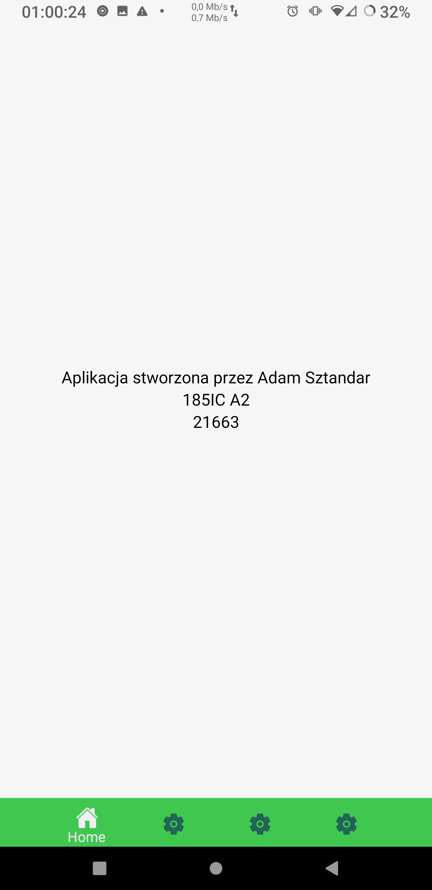
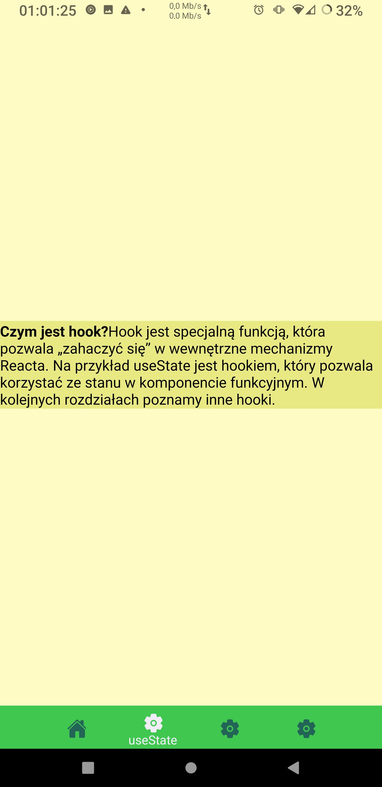
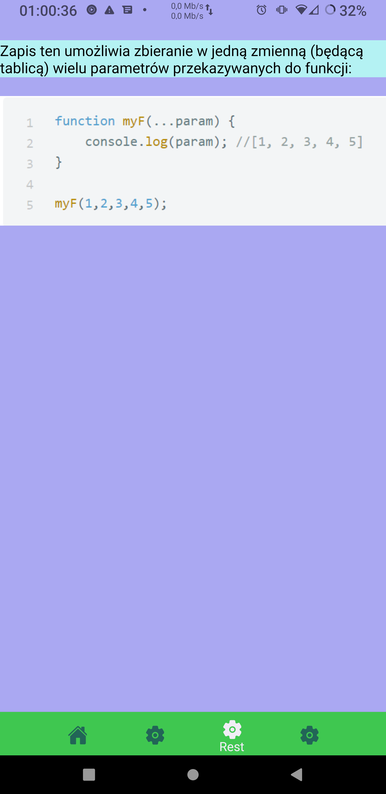
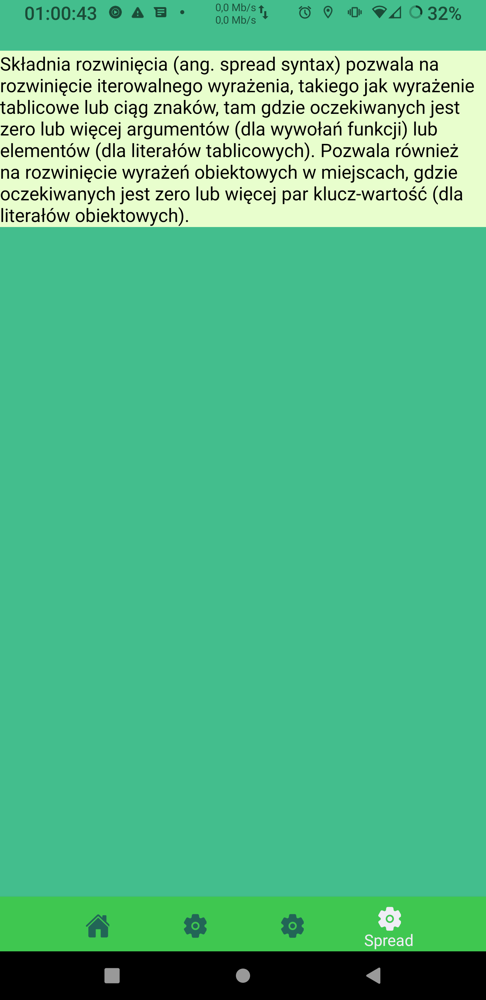

# Lab2 - responsywne layouty + nawigacja

## Słowo wstępu:

Z racji iż jestem wielkim miłośnikiem menu nawigacyjnego na dole aplikacji, zdecydowałem się aby właśnie taką nawigację zrobić.

## Wykorzystane technologie:

* React NAtive
* Expo

## Opis zadania:

poniższe zagadnienia powinny zostać zrealizowane:

* należy utworzyć 3 ekrany za pomocą react-navigation, 👍
* na każdym ekranie powinny się znaleźć przyciski pozwalające przejść do dwóch pozostałych ekranów, 👍
* każdy ekran powinien byc "ostylowany" w innym stylu niż pozostałe ekrany, z wykorzystaniem Flexboxa (m.in. poprzez moduły StyleSheet i Platform), 👍
* style należy utworzyć w pliku styles.js i zaimportować w odpowiednim miejscu, 👍
* należy umieścić na ww. ekranach informacje, czym jest spread operator, czym są rest parameters oraz do czego służy 'hook' useState, 👍

### Tworzenie projektu: :

1. W katalogu w którym chcemy tworzyć projekt inicjujemy expo: ```expo init NavbarBottomMenu```.
2. Wybieramy blank template.
3. Projekt bazowy został utworzony.
4. Instalujemy zależności.

## Wygląd i działanie aplikacji:

#### Ekran główny:



#### useState:



#### Rest parameters:



#### Spread operator:


