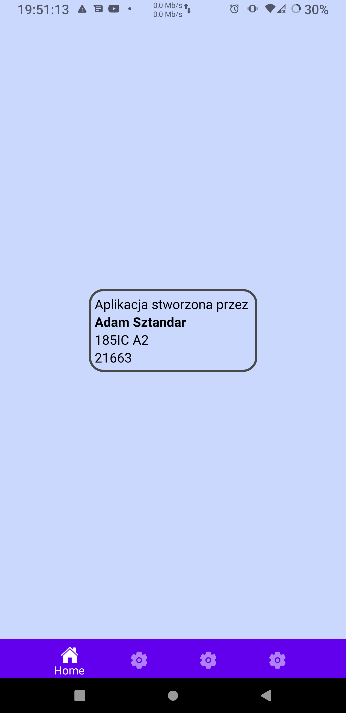
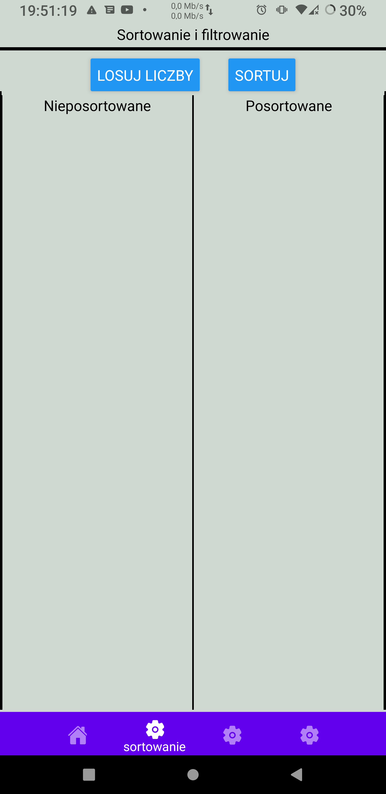
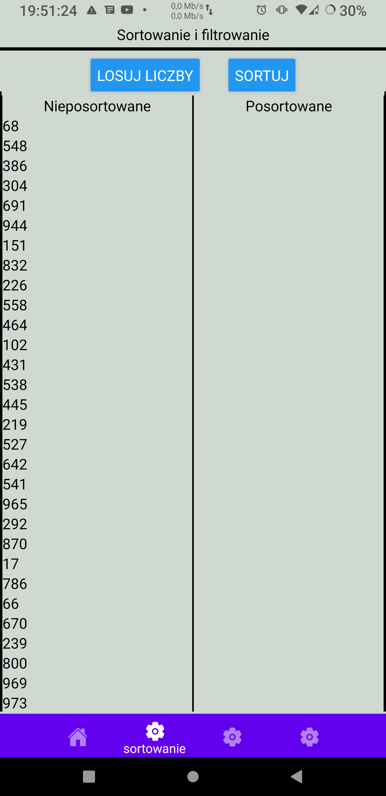
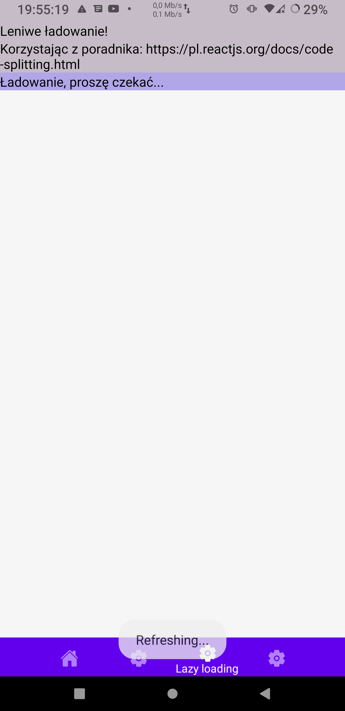
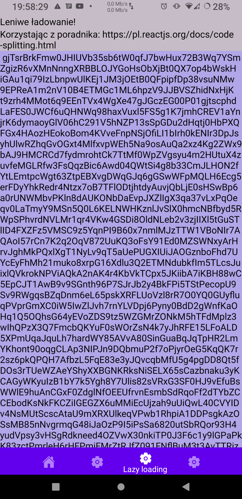
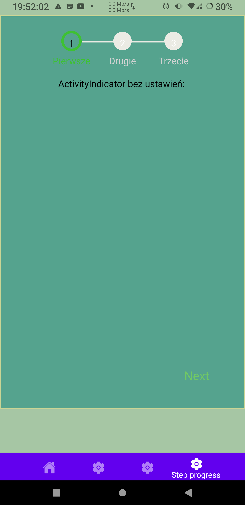
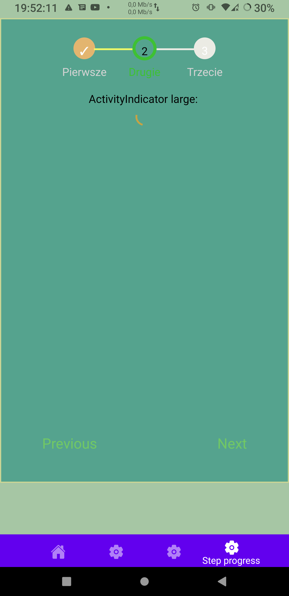
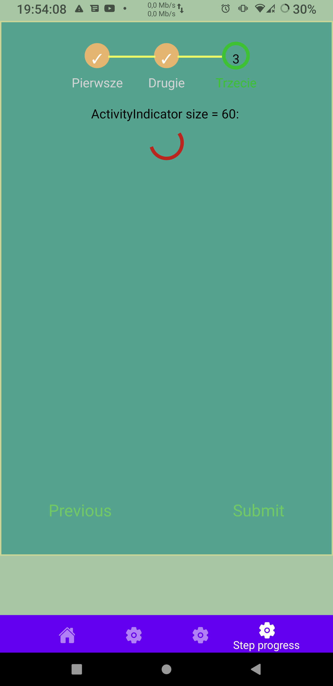

# Lab3


## Wykorzystane technologie:

* React NAtive
* Expo

### Dodatkowo wykorzystałem:  
* react-native-progress-steps

## Opis zadania:

poniższe zagadnienia powinny zostać zrealizowane:

* wskazane użycie kodu z lab. nr 2, po to żeby mieć kilka ekranów 🌞 👍
* na pierwszym ekranie należy zaimplementować sortowanie i filtrowanie danych; danymi niech będzie 100 pseudolosowych liczb całkowitych z zakresu (0, 1000), 👍
* na drugim ekranie należy zaimplementować "leniwe ładowanie" (lazy loading) listy danych; danymi niech będą pseudolosowe litery, 👍
* na ekranach od nr 3 do nr 5 należy zaimplementować progres krokowy (step progress); na kolejnych ww. ekranach powinny znaleźć się elementy ActivityIndicator  

### Tworzenie projektu: :

1. W katalogu w którym chcemy tworzyć projekt inicjujemy expo: ```expo init dataListAndProgressSupport```.
2. Wybieramy blank template.
3. Projekt bazowy został utworzony.
4. Instalujemy zależności.

## Wygląd i działanie aplikacji:

#### Ekran główny:



#### sortowanie:

  
  
  
#### Leniwe ładowanie:


  
#### step process:

  
  
  

### Dodatkowo dodałem alert jak ktoś próbuje posortowac liczby przed ich wylosowaniem.