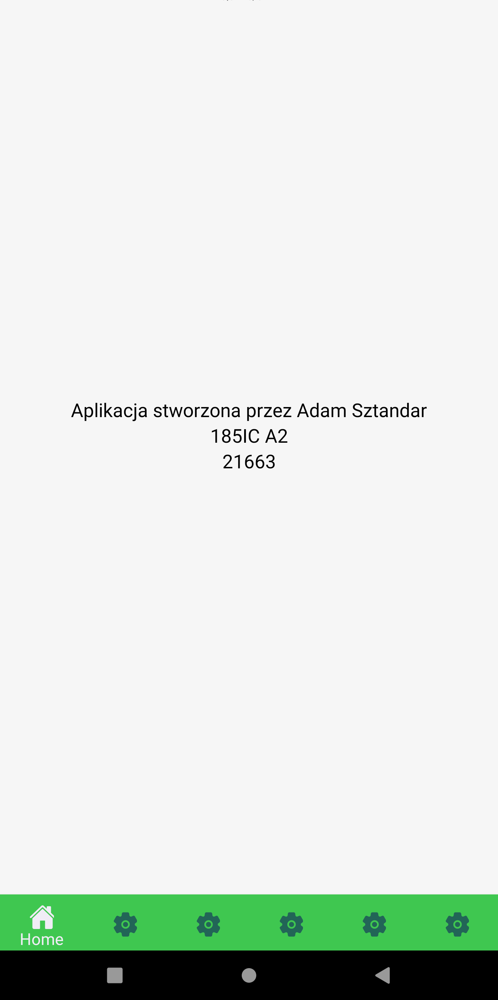
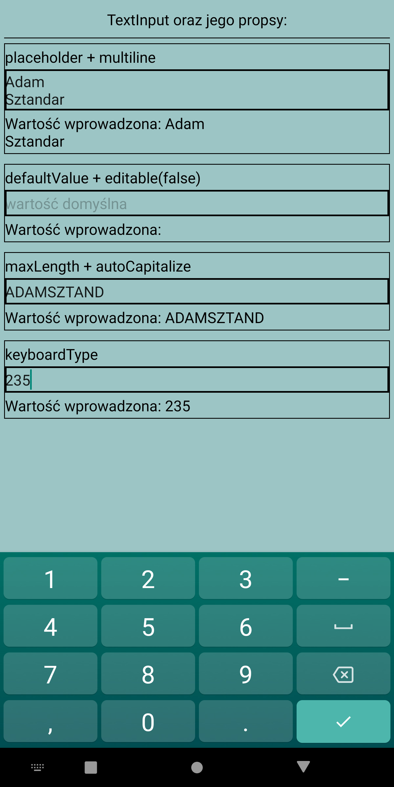
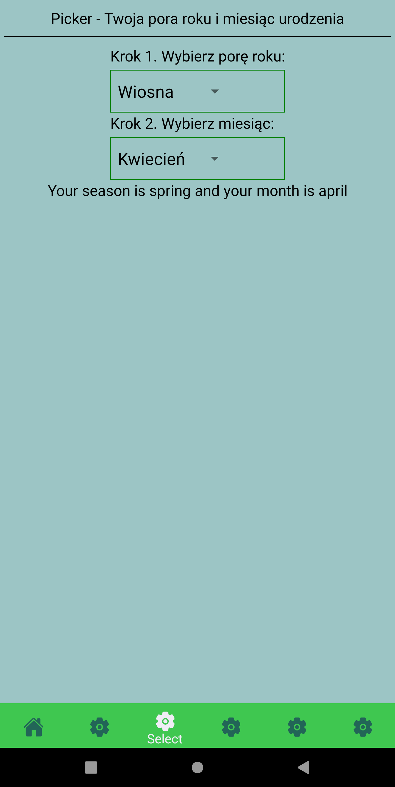
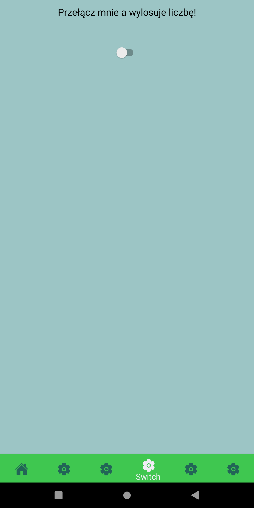
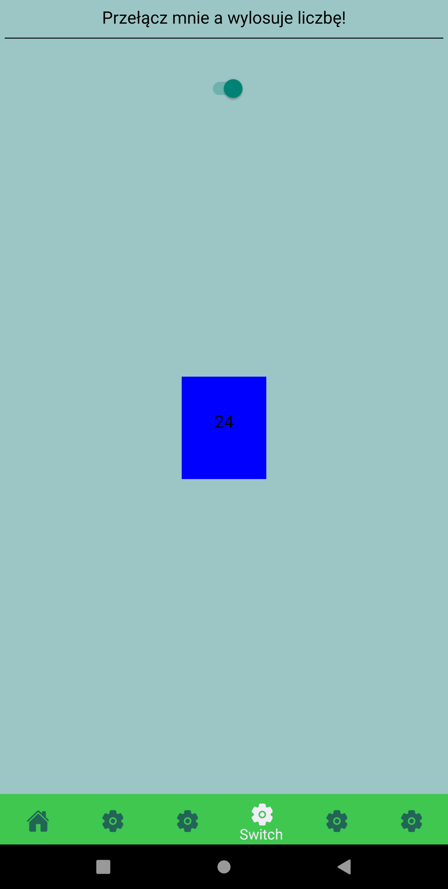
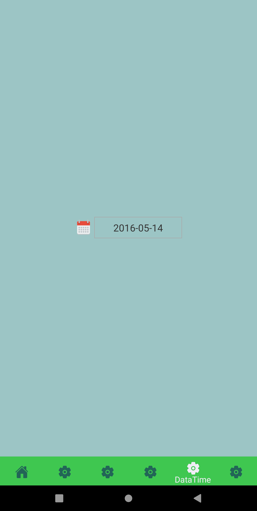
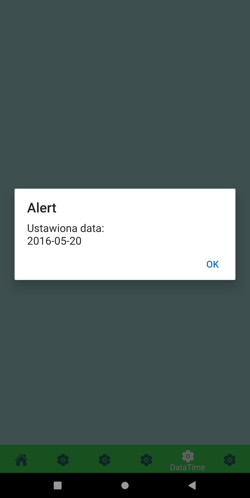
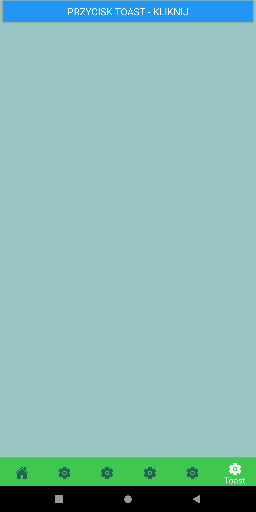
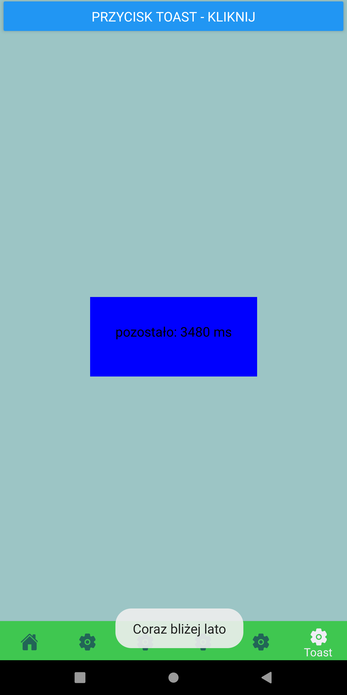

# Lab4 -  obsługa danych wprowadzanych przez użytkownika + modale


## Wykorzystane technologie:

* React Native
* Expo


### Dodatkowo wykorzystałem:  
* react-native-datepicker  
* @react-native-picker/picker  

## Opis zadania:

poniższe zagadnienia powinny zostać zrealizowane:

* wskazane użycie kodu z lab. nr 2, po to żeby mieć kilka ekranów 🌞  
* na pierwszym ekranie należy zaimplementować "przegląd" możliwości komponentu 'TextInput'; należy wykorzystać odpowiednie propsy i/lub stan danego komponentu.  
* na drugim ekranie należy zaimplementować obsługę co najmniej dwóch komponentów 'Select'; niech zmiana w jednym selektorze powoduje zmiany w pozostałych selektorach; można pokusić się o pobieranie danych do selektorów z wybranych API (np. z ćwiczeń dotyczących asynchronicznego Javascript).  
* na trzecim ekranie należy zaimplementować obsługę przełącznika 'Switch', tak aby po zmianie jego położenia pojawiał się modal z pseudolosową liczbą.  
* na czwartym ekranie należy zaimplementować wybór daty i czasu; po wciśnięciu przycisku 'Wyświetl termin' powinien pojawić się alert z wybranymi parametrami czasowymi.  
* na piątym ekranie należy zaimplementować "aktywny" modal + pasywne powiadomienia za pomocą ToastAndroid (lub jego odpowiednika w iOS); można wykorzystać funkcję setTimeout() na czas trwania obietnicy (Promise) i w tym czasie powinien być aktywny modal; ww. powiadomienie powinno się pojawić po rozwiązaniu obietnicy (resolve of Promise object).  


### Tworzenie projektu: :

1. W katalogu w którym chcemy tworzyć projekt inicjujemy expo
2. Wybieramy blank template.
3. Projekt bazowy został utworzony.
4. Instalujemy zależności.

## Wygląd i działanie aplikacji:

#### Ekran główny:



#### TextInput:  

  

```JS
import React, { useState } from "react";
import { Text, View, TextInput, ScrollView } from "react-native";

import styles from "../style/stylesheet";
const TextInputy = (props) => {
  const [text1, setText] = useState("");
  const [text2, setText2] = useState("");
  const [text3, setText3] = useState("");
  const [text4, setText4] = useState("");
  return (
    <View style={styles.textInputContainer}>
      <View style={styles.textInputHeader}>
        <Text style={styles.textCenter}>TextInput oraz jego propsy:</Text>
      </View>
      <View style={styles.textInputWrapperContent}>
        <ScrollView>
          <View style={styles.textInputExample}>
            <Text>placeholder + multiline</Text>
            <TextInput
              style={styles.textInput}
              placeholder="Wprowadź tekst"
              multiline={true}
              onChangeText={(text1) => setText(text1)}
            />
            <Text>Wartość wprowadzona: {text1}</Text>
          </View>
          <View style={styles.textInputExample}>
            <Text>defaultValue + editable(false)</Text>
            <TextInput
              style={styles.textInput}
              defaultValue="wartość domyślna"
              editable={false}
              onChangeText={(text2) => setText2(text2)}
            />
            <Text>Wartość wprowadzona: {text2}</Text>
          </View>
          <View style={styles.textInputExample}>
            <Text>maxLength + autoCapitalize</Text>
            <TextInput
              style={styles.textInput}
              maxLength= {10}
              autoCapitalize='characters'
              onChangeText={(text3) => setText3(text3)}
            />
            <Text>Wartość wprowadzona: {text3}</Text>
          </View>
          <View style={styles.textInputExample}>
            <Text>keyboardType</Text>
            <TextInput
              style={styles.textInput}
              keyboardType='number-pad'
              onChangeText={(text4) => setText4(text4)}
            />
            <Text>Wartość wprowadzona: {text4}</Text>
          </View>
        </ScrollView>
      </View>
    </View>
  );
};

export default TextInputy;

```  
Korzystam z 4ech stanów aby wyświetlać dzięki nim zmienione wartości dla każdego z TextInputa.  
* placeholder - napis który po kliknięciu w input znika, taki "label"  
* multiline - możemy pisać w wielu liniach  
* defaultValue - wartość domyśla, aby się jej pozbyć musimy ją skaskować  
* editable - jak false to nie możemy edytować inputa(jego wartości)  
* maxLength - maksymalna długość  
* autoCapitalize - automatycznie ustawia nam "capslocka"  
* kayboardType - ustawiłem na numeric aby wprowadzać jedynie cyfry  

#### Select :  

  

```JS
import React, { useState } from "react";
import { Text, View } from "react-native";
import { Picker } from "@react-native-picker/picker";

import styles from "../style/stylesheet";

class SelectExample extends React.Component {
  constructor() {
    super();
    this.state = {
      selectedSeason: "",
      selectedMonth: "",
      pickerItems: [<Picker.Item label="Wybierz porę roku" value="" key="nothing"/>],
      sentence: "",
    };
  }


  setPickerItems = (season) => {
    console.log("season: ", {season})
    if (season === "") {
      const renderElements = [ <Picker.Item label="Wybierz porę roku" value="" key="nothing"/> ]
      this.setState({ pickerItems: renderElements });
    } else if (season === "spring") {
      const renderElements = [
            <Picker.Item label="Marzec" value="march" key="march"/>,
            <Picker.Item label="Kwiecień" value="april" key="april"/>,
            <Picker.Item label="Maj" value="may" key="may"/>
      ]
      this.setState({ pickerItems: renderElements });
    } else if (season === "summer") {
      console.log("to jest lato")
      const renderElements = [
            <Picker.Item label="Czerwiec" value="june" key="june"/>,
            <Picker.Item label="Lipiec" value="july" key="july"/>,
            <Picker.Item label="Sierpień" value="august" key="august"/>
      ]
      this.setState({ pickerItems: renderElements });
    } else if (season === "autumn") {
      const renderElements = [
            <Picker.Item label="Wrzesień" value="september" key="september"/>,
            <Picker.Item label="Październik" value="october" key="october"/>,
            <Picker.Item label="Listopad" value="november" key="november"/>
      ]
      this.setState({ pickerItems: renderElements });
    } else if (season === "winter") {
      const renderElements = [
        <Picker.Item label="Grudzień" value="december" key="december"/>,
        <Picker.Item label="Styczeń" value="january" key="january"/>,
        <Picker.Item label="Luty" value="february" key="february"/>
      ]
           
      this.setState({ pickerItems: renderElements });
    }
  };

  setSentence = (selectedMonth) =>{
    
    this.setState({selectedMonth})
    console.log("selMon: ", this.state.selectedMonth)
    const sentence = "Your season is " + this.state.selectedSeason + " and your month is " + selectedMonth;
    this.setState({ sentence: sentence})
  }

  render() {
    return (
      <View style={styles.containerSelect}>
        <View style={styles.selectHeader}>
          <Text style={styles.textCenter}>
            Picker - Twoja pora roku i miesiąc urodzenia
          </Text>
        </View>
        <View style={styles.selectWrapper}>
          <Text>Krok 1. Wybierz porę roku:</Text>
          <View style={styles.pickerView}>
            <Picker
              style={styles.picker}
              mode={"dropdown"}
              selectedValue={this.state.selectedSeason}
              onValueChange={(itemValue, itemIndex) => {
                this.setState({ selectedSeason: itemValue });
                this.setPickerItems(itemValue);
              }}
            >
              <Picker.Item label="Wybierz" value="" />
              <Picker.Item label="Wiosna" value="spring" />
              <Picker.Item label="Lato" value="summer" />
              <Picker.Item label="Jesień" value="autumn" />
              <Picker.Item label="Zima" value="winter" />
            </Picker>
          </View>
          <Text>Krok 2. Wybierz miesiąc:</Text>
          <View style={styles.pickerView}>
            <Picker
              style={styles.picker}
              mode={"dropdown"}
              selectedValue={this.state.selectedMonth}
              onValueChange={(itemValue2, itemIndex) =>{
                console.log({itemValue2})
                this.setState({ selectedMonth: itemValue2 })
                this.setSentence(itemValue2);
              }
              }
            >
              {this.state.pickerItems}
            </Picker>
          </View>
        </View>
        <Text style={styles.textCenter}>
          {this.state.sentence}
        </Text>
      </View>
    );
  }
}

export default SelectExample;

```  
W zależności od wybranej pory roku, w pickerze nr2 wyświetlą się miesiące (należące do danej pory roku). Wybór pory roku oraz miesiąca zmienia zdanie na dole. Wykorzystuje tutaj stany komponentu.  

#### Switch: 
* po zmianie położenia switcha pojawi się modal

  
  
```JS
import React, { useState } from "react";
import { Text, View, Switch, Modal } from "react-native";

import styles from "../style/stylesheet";
const Switcher = (props) => {
    const [modalVisible, setModalVisible] = useState(false);
  const [isSwitchOn, setIsSwitchOn] = useState(false);
  const onToggleSwitch = () => setIsSwitchOn(!isSwitchOn);
  return (
    <View style={styles.containerSelect}>
      <View style={styles.selectHeader}>
        <Text style={styles.textCenter}>Przełącz mnie a wylosuje liczbę!</Text>
      </View>
      <View style={styles.switchContent}>
        <Switch value={isSwitchOn} onValueChange={onToggleSwitch} />
        <Modal
          animationType="slide"
          transparent={true}
          visible={isSwitchOn}
          onRequestClose={() => {
            setModalVisible(!isSwitchOn);
          }}
        >
          <View style={styles.viewModalContent}>
            <View style={styles.modalView}>
              <Text style={styles.modalText} onPress={onToggleSwitch}>
                {Math.floor(Math.random() * 100)}
              </Text>
            </View>
          </View>
        </Modal>
      </View>
    </View>
  );
};

export default Switcher;

```  
Korzystałem tutaj z Modala z przykładu z lekkimi modyfikacjami.  
 
#### DataPicker:  
* po wyborze daty wyświetli się alert z wybraną datą  

  
  

```JS
import React, { Component } from 'react';
import { Text, View } from "react-native";
import DatePicker from 'react-native-datepicker';

import styles from "../style/stylesheet";

export default class PickerDataTime extends Component {
  constructor(props){
    super(props)
    this.state = {date:"2016-05-15"}
  }

  render(){
    return (
        <View style={styles.containerSelect}>
            <View style={styles.toCenter}>
      <DatePicker
        style={{width: 200}}
        date={this.state.date}
        mode="date"
        placeholder="select date"
        format="YYYY-MM-DD"
        minDate="2016-05-01"
        maxDate="2022-06-01"
        confirmBtnText="Confirm"
        cancelBtnText="Cancel"
        customStyles={{
          dateIcon: {
            position: 'absolute',
            left: 0,
            top: 4,
            marginLeft: 0
          },
          dateInput: {
            marginLeft: 36
          }
          // ... You can check the source to find the other keys.
        }}
        onDateChange={(date) => {
            this.setState({date: date})
            alert("Ustawiona data: \n" + this.state.date)
        }}
      />
      </View>
      </View>
    )
  }
}
```  
Sam komponent jest bardzo prosty, mamy ustalone daty, przy kliknięciu w komponent zaznaczona jest aktualna data, możemy ustawiać zakresy dat. Alert wywołuje po zmianie daty (w onDateChange)  

#### Toast:  
* po kliknieciu na przycisk wyświetli nam się modal a po nim wiadomość "Coraz bliżej lato"

  
  

```JS
import React, { useEffect, useState} from 'react';
import {Button, Modal,ToastAndroid, Text, View } from 'react-native';
import styles from '../style/stylesheet'


const Toast = ({ visible, message }) => {
    if (visible) {
      ToastAndroid.showWithGravityAndOffset(
        message,
        ToastAndroid.LONG,
        ToastAndroid.BOTTOM,
        25,
        50
      );
      return null;
    }
    return null;
  };


const ToastButton = () => {
    const [visibleToast, setVisibleToast] = useState(false);
    useEffect(() => setVisibleToast(false), [visibleToast]);
    const handleButtonPress = () => {
      setVisibleToast(true);
    };
    const [isSwitchOn, setIsSwitchOn] = React.useState(false);
    const onToggleSwitch = () => setIsSwitchOn(!isSwitchOn);
    const [time, setTime] = useState(0);
    var promise = null
    const createPromise = () => {
        var tempTime = Math.floor(Math.random()*10000)
        setTime(tempTime)
        promise = new Promise((resolve, reject) => {
            setTimeout(() => {
                resolve('hide');
            }, tempTime);
        });
    }

    return (
        
        <View style={styles.containerSelect}>
            <Toast visible={visibleToast} message="Coraz bliżej lato" />
            <Button title="Przycisk TOAST - Kliknij" onPress={() => {
                onToggleSwitch()
                handleButtonPress()
                createPromise()
                promise.then((value) => {
                    if(value == 'hide'){
                        setIsSwitchOn(false)
                    }
                });
            }}/>
            <Modal
                animationType="fade"
                transparent={true}
                visible={isSwitchOn}
                onRequestClose={() => {
                    setModalVisible(!isSwitchOn);
                }}
            >
                <View style={styles.viewModalContent}>
                    <View style={styles.modalView} >
                        <Text style={styles.modalText} onPress={onToggleSwitch} >pozostało: {time} ms</Text>
                    </View>
                </View>
            </Modal> 
        </View>
    );
};

export default ToastButton;

```
Wykorzystuje tutaj mechanizmy z podzadania "Switch".

### NAVBAR:

* Navbar widnieje na każdej ze stron w dolnej belce.

```JS
import React from "react";
import { View } from "react-native";
import { createAppContainer } from "react-navigation";
import { createMaterialBottomTabNavigator } from "react-navigation-material-bottom-tabs";
import Icon from "react-native-vector-icons/Ionicons";

import HomeScreen from "./Home.js";
import TextInputy from "./textinputy.js";
import SelectExample from "./selectExample.js";
import Switcher from "./switcher.js";
import PickerDataTime from "./pickerDataTime.js"
import ToastButton from "./toast.js";

const TabBottomNavigator = createMaterialBottomTabNavigator(
  {
    Home: {
      screen: HomeScreen,
      navigationOptions: {
        tabBarLabel: "Home",
        tabBarIcon: ({ tintColor }) => (
          <View>
            <Icon style={[{ color: tintColor }]} size={26} name={"ios-home"} />
          </View>
        ),
      },
    },

    InputyText: {
      screen: TextInputy,
      navigationOptions: {
        tabBarLabel: "TextInput",
        tabBarIcon: ({ tintColor }) => (
          <View>
            <Icon
              style={[{ color: tintColor }]}
              size={26}
              name={"ios-settings"}
            />
          </View>
        ),
      },
    },

    Select: {
      screen: SelectExample,
      navigationOptions: {
        tabBarLabel: "Select",
        tabBarIcon: ({ tintColor }) => (
          <View>
            <Icon
              style={[{ color: tintColor }]}
              size={26}
              name={"ios-settings"}
            />
          </View>
        ),
      },
    },

    Switch: {
      screen: Switcher,
      navigationOptions: {
        tabBarLabel: "Switch",
        tabBarIcon: ({ tintColor }) => (
          <View>
            <Icon
              style={[{ color: tintColor }]}
              size={26}
              name={"ios-settings"}
            />
          </View>
        ),
      },
    },

    PickerDT: {
      screen: PickerDataTime,
      navigationOptions: {
        tabBarLabel: "DataTime",
        tabBarIcon: ({ tintColor }) => (
          <View>
            <Icon
              style={[{ color: tintColor }]}
              size={26}
              name={"ios-settings"}
            />
          </View>
        ),
      },
    },

    Toas: {
      screen: ToastButton,
      navigationOptions: {
        tabBarLabel: "Toast",
        tabBarIcon: ({ tintColor }) => (
          <View>
            <Icon
              style={[{ color: tintColor }]}
              size={26}
              name={"ios-settings"}
            />
          </View>
        ),
      },
    },
  },

  {
    initialRouteName: "Home",
    activeColor: "#f0edf6",
    inactiveColor: "#226557",

    barStyle: {
      backgroundColor: "#3fc750",
    },
  }
);

export default createAppContainer(TabBottomNavigator);

```

Patrząc na coraz to większą ilość ekranów (activitis) rozwiązanie to nie należy do najlepszych.