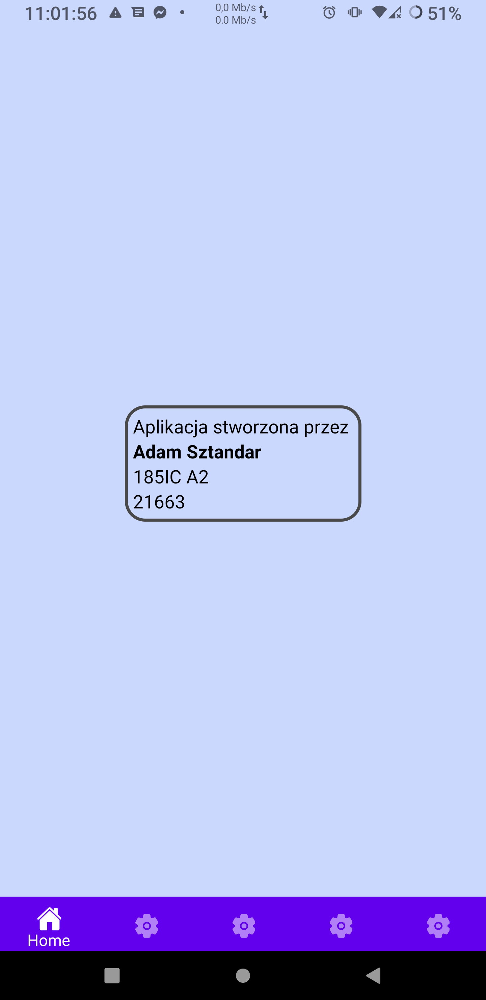
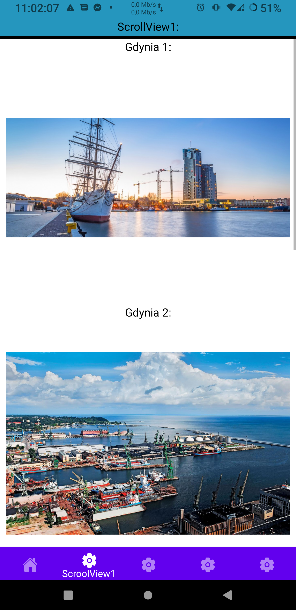
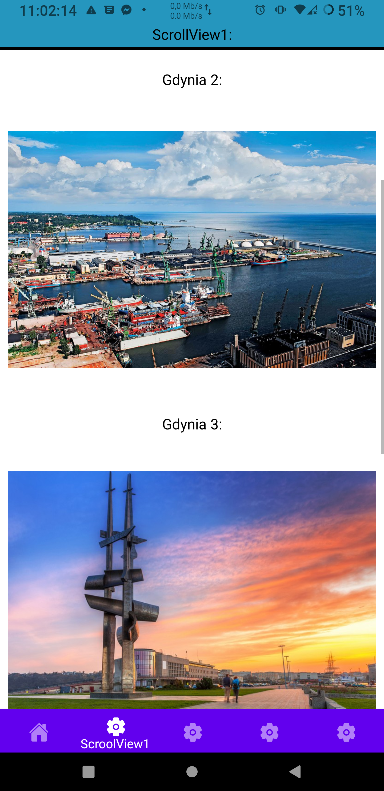
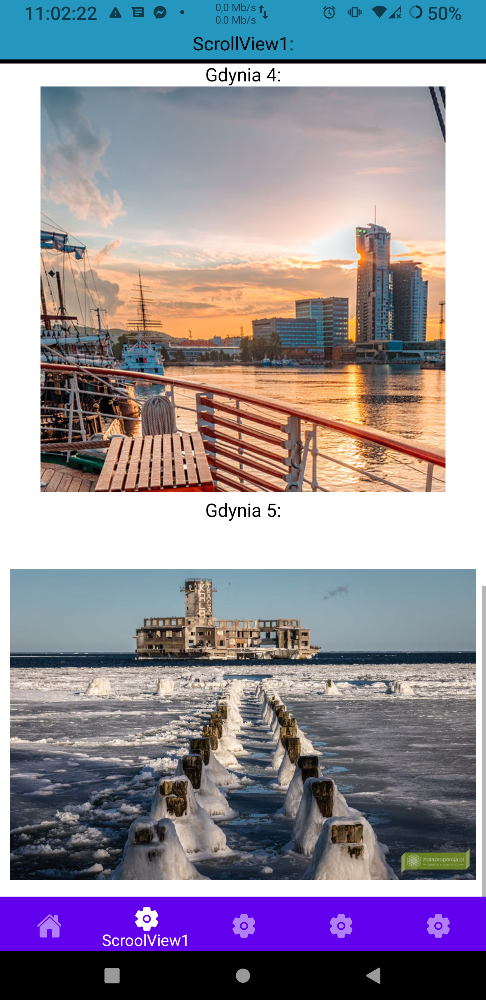
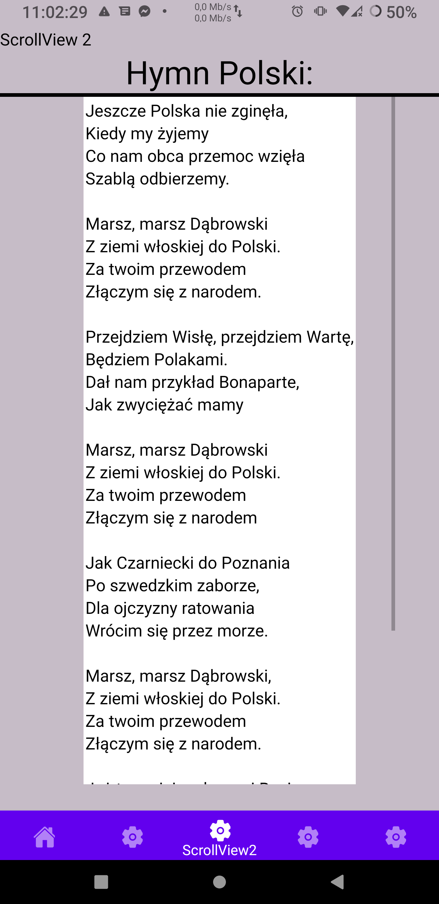
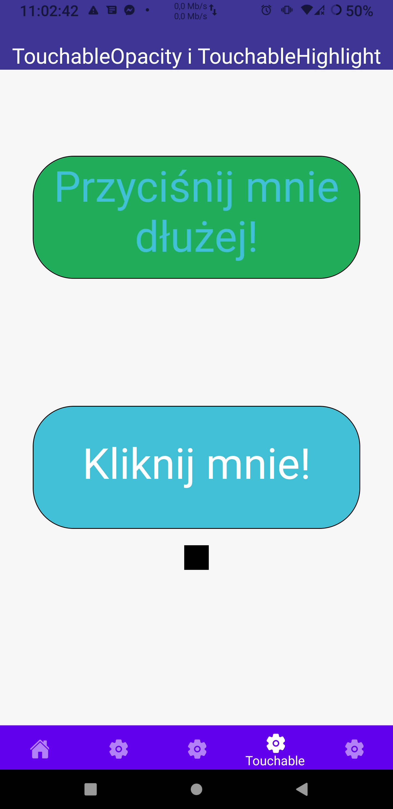
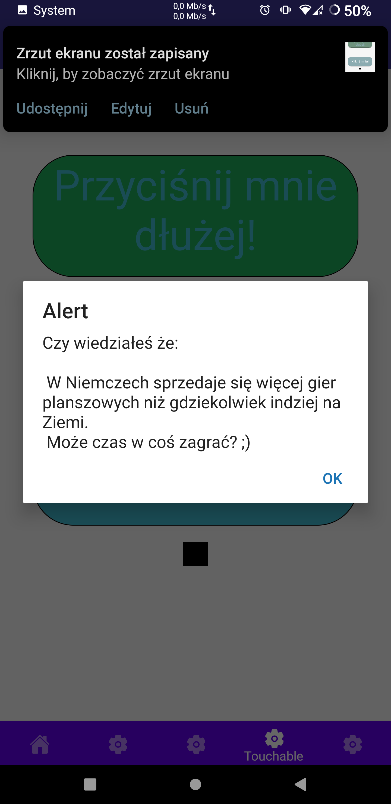
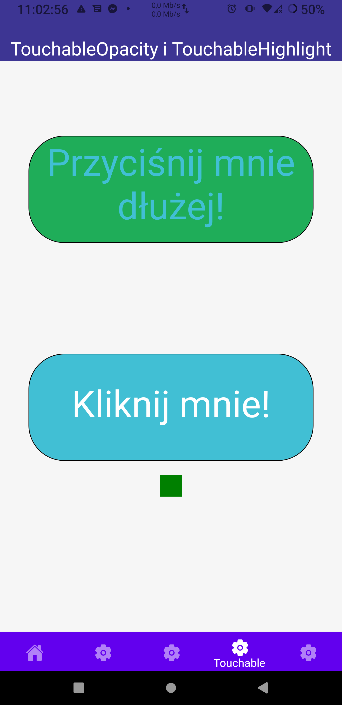
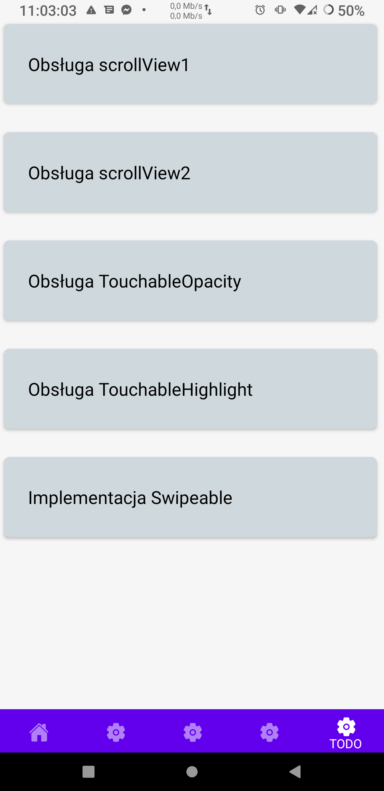
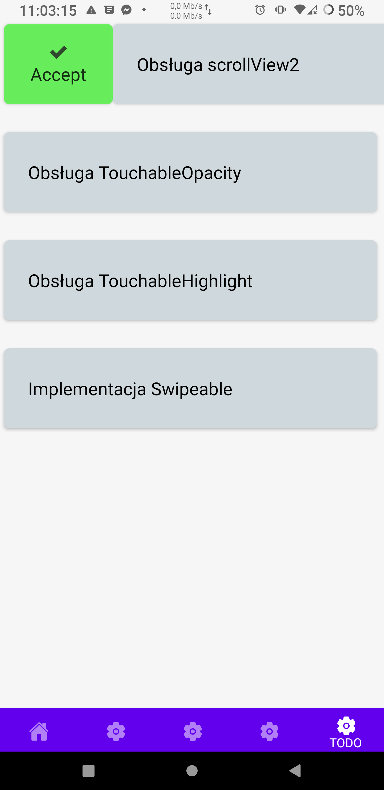

# Lab5 -  obsługa gestów użytkownika

## Wykorzystane technologie:

* React Native
* Expo

### Dodatkowo wykorzystałem:  
* TouchableOpacity
* TouchableHighlight
* swipeable

## Opis zadania:

poniższe zagadnienia powinny zostać zrealizowane:

* wskazane użycie kodu z lab. nr 2, po to żeby mieć kilka ekranów 🌞  
* na pierwszym i na drugim ekranie należy zaimplementować użycie komponentu ScrollView, na każdym z nich powinnny być różne style (Flexbox) oraz widoczny pasek przewijania (scrollbar)  
* na trzecim ekranie należy zaimplementować użycie komponentów TouchableOpacity i TouchableHighlight; na ➕ można pokusić się o użycie komponentu WebView po naciśnięciu przycisku,  
* na czwartym ekranie należy zaimplementować obsługę przesunięć palcem (komponent Swipeable);  

### Tworzenie projektu: :

1. W katalogu w którym chcemy tworzyć projekt inicjujemy expo
2. Wybieramy blank template.
3. Projekt bazowy został utworzony.
4. Instalujemy zależności.

## Wygląd i działanie aplikacji:

#### Ekran główny:

#### ScrollView1(skorzystałem tutaj również z lazy loading aby poczekać aż zdjęcia się załadują):  

  
  
  
#### ScrollView2 :  

  
#### TouchableOpacity i TouchableHighlight: 
* po kliknięciu w  "Kliknij mnie" zmienia się kolor kwadracika na dole  

  
  
  
#### Swipeable:  

  
  
