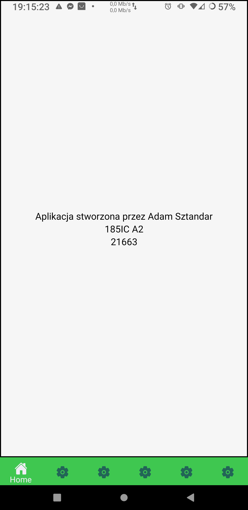
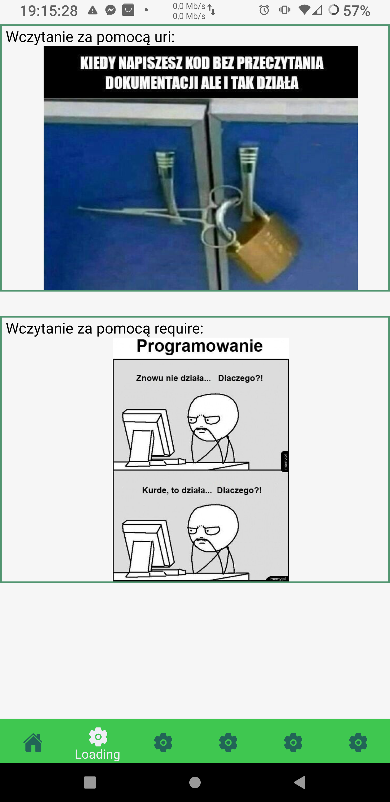
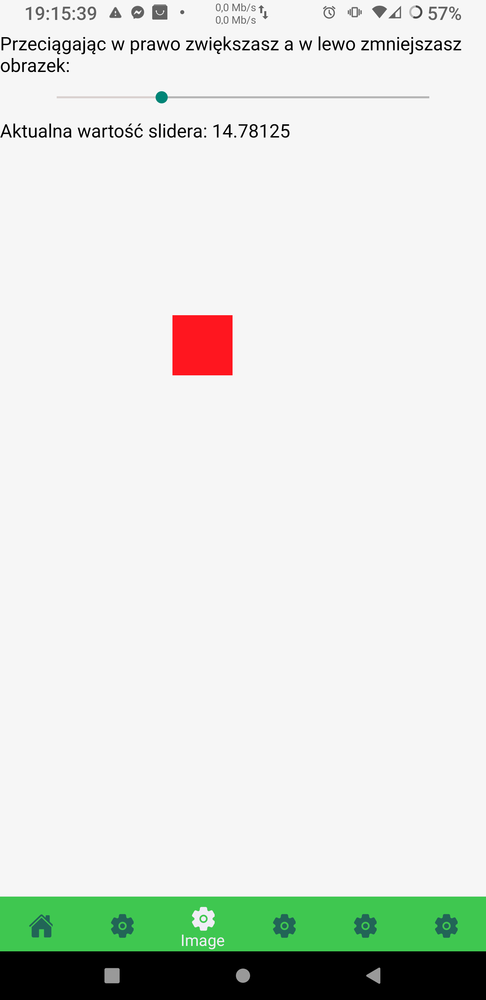
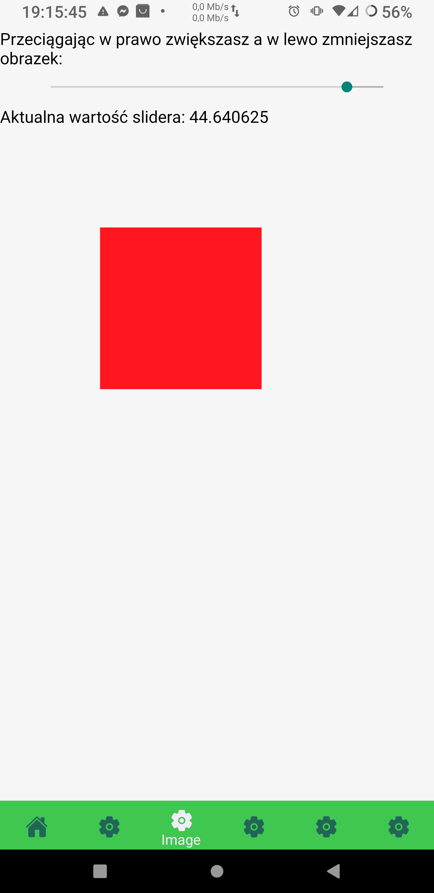
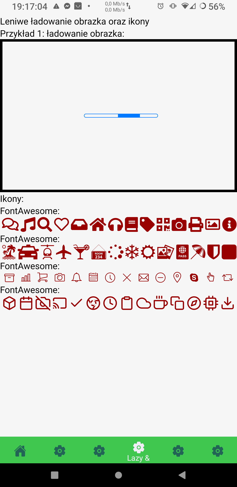
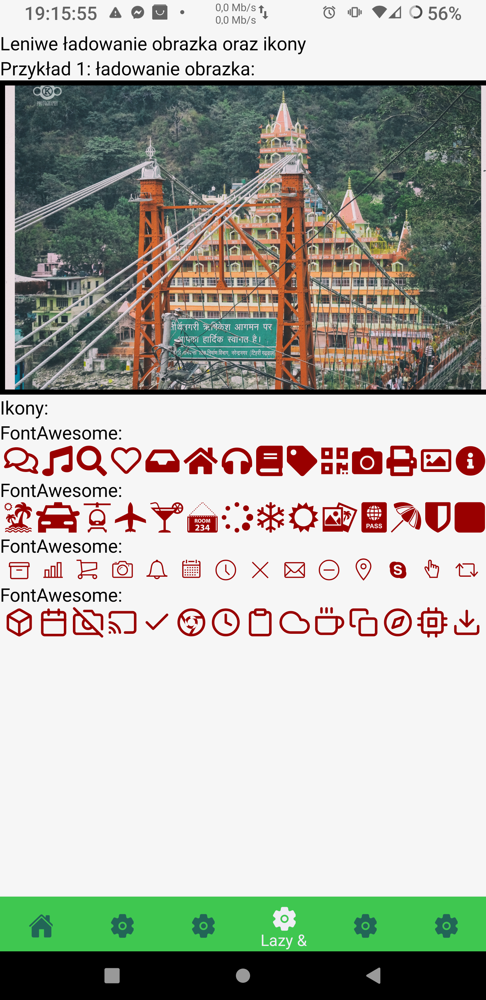
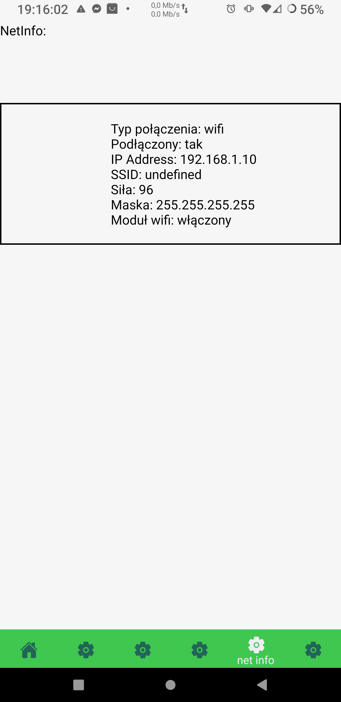
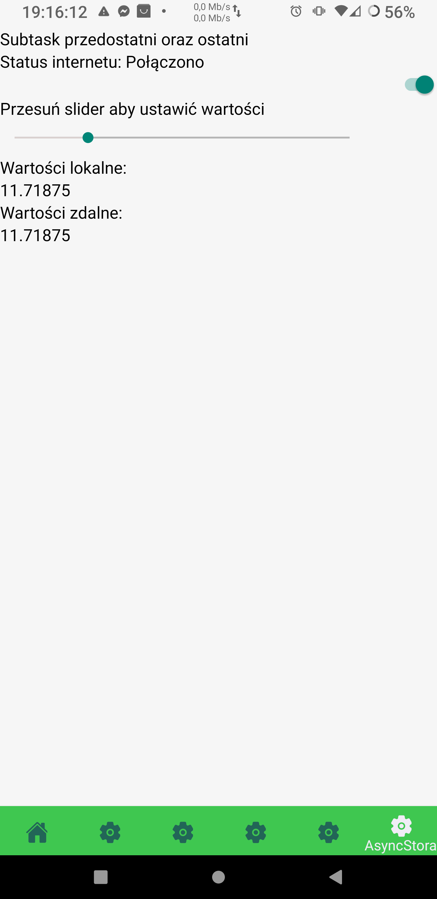
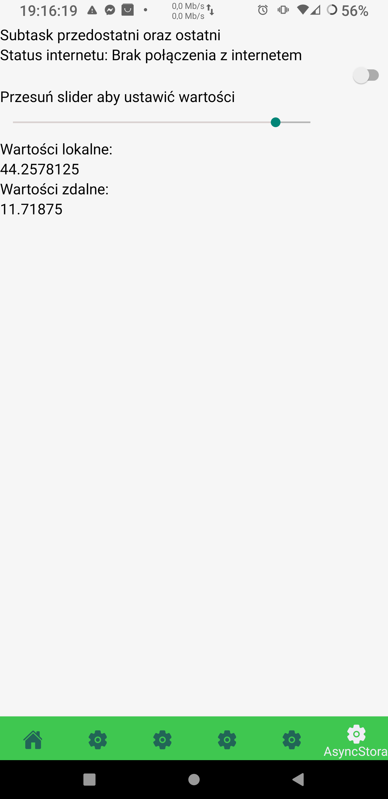

# Lab6 -  obsługa obrazów + tryb offline


## Wykorzystane technologie:

* React Native
* Expo


### Dodatkowo wykorzystałem:  
* AsyncStorage "@react-native-async-storage/async-storage"  
* NetInfo @react-native-community/netinfo" 

## Opis zadania:

poniższe zagadnienia powinny zostać zrealizowane:

* wskazane użycie kodu z lab. nr 2, po to żeby mieć kilka ekranów 🌞  
* na pierwszym ekranie należy zaimplementować ładowanie dwóch obrazków (komponent Image) - pierwszy za pomocą właściwości 'uri', a drugi z użyciem metody require().  
* na drugim ekranie należy zaimplementować zmianę rozmiaru ładowanego obrazka za pomocą komponentu Slider, (można też na pierwszym ekranie załadować jeden obrazek ze sliderem i na drugim ekranie podobnie).  
* na trzecim ekranie należy zaimplementować 'leniwe' ładowanie obrazka oraz renderowanie wybranego zestawu ikon.  
* na kolejnym ekranie należy zaimplementować detekcję łączności z siecią i wyświetlić odpowiednią informację.  
* na kolejnym ekranie należy zaimplementować obsługę zapisu danych aplikacji za pomocą AsyncStorage.  
* na ostatnim ekranie należy zaimplementować obsługę synchronizacji danych aplikacji (np. stanu wybranych elementów), w przypadkach łączności z siecią i jej braku,  

Podpunkt przedostatni o ostatni zrealizowałem w jednym 

### Tworzenie projektu: :

1. W katalogu w którym chcemy tworzyć projekt inicjujemy expo
2. Wybieramy blank template.
3. Projekt bazowy został utworzony.
4. Instalujemy zależności.

## Wygląd i działanie aplikacji:

#### Ekran główny:



#### Wczytywanie obrazów:  

  
```JS
import React from "react";
import { Text, View, Image } from "react-native";

import styles from "../style/stylesheet";
const LoadingImage = (props) => {
  return (
    <View style={styles.loadingImageContainer}>
      <View style={styles.loadingImageExample}>
        <Text>Wczytanie za pomocą uri:</Text>
        <Image style={styles.image} source={{uri: 'https://baxu.pl/storage/posts/January2020/comment_2GKqXI1n6jndWsLGnHjhtVMoB9wst7ib.jpg',}}  /> 
      </View>
      <View style={styles.loadingImageExample}>
        <Text>Wczytanie za pomocą require:</Text>
        <Image style={styles.image} source={require('../assets/15232084880351.jpg')}  /> 
      </View>
    </View>
  );
};

export default LoadingImage;

```
Za pomocą komponentu Image wczytuje obrazy. Wykorzystuje do tego props source.  
#### Slider:  

  
  
```JS
import React from "react";
import { Text, View, Image } from "react-native";
import Slider from "@react-native-community/slider";

import styles from "../style/stylesheet";


export default class ImageSlider extends React.Component {
  constructor(props) {
    super(props);
    this.state = {
        sliderValue: 1,
    }
  }

  handleSlider = (value) => {
    this.setState({sliderValue: value})
  }

  render() {
    return (
      <View style={styles.sliderImageContainer}>
        <View>
          <Text>
            Przeciągając w prawo zwiększasz a w lewo zmniejszasz obrazek:
          </Text>
        </View>
        <View style={styles.sliderContent}>
          <Slider
            style={{ width: 400, height: 40 }}
            minimumValue={1}
            maximumValue={50}
            minimumTrackTintColor="#d9d1d0"
            maximumTrackTintColor="#000000"
            onValueChange={this.handleSlider}
          />
        </View>
        <View>
            <Text>
                Aktualna wartość slidera: {this.state.sliderValue}
            </Text>
        </View>
        <Image source={require('../assets/kwadrat.png')} style={[{transform: [{ scale: this.state.sliderValue * 0.01 }]}]}/> 
      </View>
    );
  }
}
```  
Wykorzystuje komponent Slider. Ustawiam w nim długość oraz szerokość, wartość minimalną (ustawiłem na 1 aby od razu obrazek był widoczny), wartość maksymalną, kolory oraz reakcje na zmianę wartości.  
handleSlider ustawia stan po zmianie wartości slidera.  

#### Lazy loading oraz ikony:  

  
  

```JS
import React from "react";
import { Text, View } from "react-native";
import Image from "react-native-image-progress";
import ProgressBar from "react-native-progress/Bar";

import FontAwesome from "react-native-vector-icons/FontAwesome5";
import Feather from "react-native-vector-icons/Feather";
import EvilIcons from "react-native-vector-icons/EvilIcons";
import Fontisto from "react-native-vector-icons/Fontisto";

import styles from "../style/stylesheet";
export default class lazyRender extends React.Component {
  render() {
    return (
      <View style={styles.lazyRenderContainer}>
        <Text>Leniwe ładowanie obrazka oraz ikony</Text>
        <View>
          <Text>Przykład 1: ładowanie obrazka:</Text>
          <View style={{ borderWidth: 5 }}>
            <Image
              source={{
                uri: "https://images.pexels.com/photos/3584871/pexels-photo-3584871.jpeg?auto=compress&cs=tinysrgb&dpr=2&h=3828&w=5104",
              }}
              indicator={ProgressBar}
              style={styles.image}
            />
          </View>
        </View>

        <View>
          <Text>Ikony:</Text>
          <View>
            <Text>FontAwesome:</Text>
            <View style={styles.icons}>
              <FontAwesome style={{marginLeft: 4}} name="comments" size={30} color="#900" />
              <FontAwesome style={{marginLeft: 4}} name="music" size={30} color="#900" />
              <FontAwesome style={{marginLeft: 4}} name="search" size={30} color="#900" />
              <FontAwesome style={{marginLeft: 4}} name="heart" size={30} color="#900" />
              <FontAwesome style={{marginLeft: 4}} name="inbox" size={30} color="#900" />
              <FontAwesome style={{marginLeft: 4}} name="home" size={30} color="#900" />
              <FontAwesome style={{marginLeft: 4}} name="headphones" size={30} color="#900" />
              <FontAwesome style={{marginLeft: 4}} name="book" size={30} color="#900" />
              <FontAwesome style={{marginLeft: 4}} name="tag" size={30} color="#900" />
              <FontAwesome style={{marginLeft: 4}} name="qrcode" size={30} color="#900" />
              <FontAwesome style={{marginLeft: 4}} name="camera" size={30} color="#900" />
              <FontAwesome style={{marginLeft: 4}} name="print" size={30} color="#900" />
              <FontAwesome style={{marginLeft: 4}} name="image" size={30} color="#900" />
              <FontAwesome style={{marginLeft: 4}} name="info-circle" size={30} color="#900" />
            </View>
          </View>

          <View>
            <Text>FontAwesome:</Text>
            <View style={styles.icons}>
              <Fontisto style={{marginLeft: 4}} name="island" size={30} color="#900" />
              <Fontisto style={{marginLeft: 4}} name="taxi" size={30} color="#900" />
              <Fontisto style={{marginLeft: 4}} name="helicopter" size={30} color="#900" />
              <Fontisto style={{marginLeft: 4}} name="plane" size={30} color="#900" />
              <Fontisto style={{marginLeft: 4}} name="cocktail" size={30} color="#900" />
              <Fontisto style={{marginLeft: 4}} name="room" size={30} color="#900" />
              <Fontisto style={{marginLeft: 4}} name="spinner" size={30} color="#900" />
              <Fontisto style={{marginLeft: 4}} name="snowflake" size={30} color="#900" />
              <Fontisto style={{marginLeft: 4}} name="sun" size={30} color="#900" />
              <Fontisto style={{marginLeft: 4}} name="photograph" size={30} color="#900" />
              <Fontisto style={{marginLeft: 4}} name="passport" size={30} color="#900" />
              <Fontisto style={{marginLeft: 4}} name="parasol" size={30} color="#900" />
              <Fontisto style={{marginLeft: 4}} name="shield" size={30} color="#900" />
              <Fontisto style={{marginLeft: 4}} name="curve" size={30} color="#900" />
            </View>
          </View>

          <View>
            <Text>FontAwesome:</Text>
            <View style={styles.icons}>
              <EvilIcons style={{marginLeft: 4}} name="archive" size={30} color="#900" />
              <EvilIcons style={{marginLeft: 4}} name="chart" size={30} color="#900" />
              <EvilIcons style={{marginLeft: 4}} name="cart" size={30} color="#900" />
              <EvilIcons style={{marginLeft: 4}} name="camera" size={30} color="#900" />
              <EvilIcons style={{marginLeft: 4}} name="bell" size={30} color="#900" />
              <EvilIcons style={{marginLeft: 4}} name="calendar" size={30} color="#900" />
              <EvilIcons style={{marginLeft: 4}} name="clock" size={30} color="#900" />
              <EvilIcons style={{marginLeft: 4}} name="close" size={30} color="#900" />
              <EvilIcons style={{marginLeft: 4}} name="envelope" size={30} color="#900" />
              <EvilIcons style={{marginLeft: 4}} name="minus" size={30} color="#900" />
              <EvilIcons style={{marginLeft: 4}} name="location" size={30} color="#900" />
              <EvilIcons style={{marginLeft: 4}} name="sc-skype" size={30} color="#900" />
              <EvilIcons style={{marginLeft: 4}} name="pointer" size={30} color="#900" />
              <EvilIcons style={{marginLeft: 4}} name="retweet" size={30} color="#900" />
            </View>
          </View>

          <View>
            <Text>FontAwesome:</Text>
            <View style={styles.icons}>
              <Feather style={{marginLeft: 4}} name="box" size={30} color="#900" />
              <Feather style={{marginLeft: 4}} name="calendar" size={30} color="#900" />
              <Feather style={{marginLeft: 4}} name="camera-off" size={30} color="#900" />
              <Feather style={{marginLeft: 4}} name="cast" size={30} color="#900" />
              <Feather style={{marginLeft: 4}} name="check" size={30} color="#900" />
              <Feather style={{marginLeft: 4}} name="chrome" size={30} color="#900" />
              <Feather style={{marginLeft: 4}} name="clock" size={30} color="#900" />
              <Feather style={{marginLeft: 4}} name="clipboard" size={30} color="#900" />
              <Feather style={{marginLeft: 4}} name="cloud" size={30} color="#900" />
              <Feather style={{marginLeft: 4}} name="coffee" size={30} color="#900" />
              <Feather style={{marginLeft: 4}} name="copy" size={30} color="#900" />
              <Feather style={{marginLeft: 4}} name="compass" size={30} color="#900" />
              <Feather style={{marginLeft: 4}} name="cpu" size={30} color="#900" />
              <Feather style={{marginLeft: 4}} name="download" size={30} color="#900" />
            </View>
          </View>
        </View>
      </View>
    );
  }
}
```  
Do wczytywania obrazu (ten moment zanim się wczyta) wykorzystuje progress bar aby było wiadome że zachodzi interakcja.  

#### Netstat  

  
```JS
import React, { useState, useEffect } from "react";
import { SafeAreaView, View, Text, Button } from "react-native";
import NetInfo from "@react-native-community/netinfo";
import styles from "../style/stylesheet";

const netInfo = () => {
  const [netInfo, setNetInfo] = useState("");
  useEffect(() => {
    // Subscribe to network state updates
    const unsubscribe = NetInfo.addEventListener((state) => {
      setNetInfo(
        `
        Typ połączenia: ${state.type}
        Podłączony: ${state.isConnected ? "tak" : "nie"}
        IP Address: ${state.details.ipAddress}
        SSID: ${state.details.ssid}
        Siła: ${state.details.strength}
        Maska: ${state.details.subnet}
        Moduł wifi: ${state.isWifiEnabled ? "włączony" : "wyłączony"}
        `
      );
    });

    return () => {
      unsubscribe();
    };
  }, []);

  return (
    <SafeAreaView style={styles.netInfoContainer}>
      <View>
        <Text>NetInfo:</Text>
        <View style={styles.netInfoContent}>
          <Text>
            {netInfo}
          </Text>
        </View>
      </View>
    </SafeAreaView>
  );
};
export default netInfo;
```  

#### AsyncStorage  

  
  

```JS
import React from "react";
import {Text,View,Switch,} from "react-native";
import AsyncStorage from "@react-native-async-storage/async-storage";
import Slider from "@react-native-community/slider";
import styles from "../style/stylesheet";
import NetInfo from "@react-native-community/netinfo";

export default class SaveData extends React.Component {
  constructor(props) {
    super(props);
    this.state = {
      connection: true,
      local: "",
      remote: "",
      internet: false,
    };
  }
  handleSlider = async (value) => {
    const key = "local";
    await AsyncStorage.setItem(key, value.toString());
    const tempValue = await AsyncStorage.getItem(key);
    if (tempValue !== null) {
      this.setState({ local: tempValue });
    } else {
      this.setState({ local: "" });
    }
  };
  // funkcja sprawdzająca integralnośc danych lokalnych i zdalnych
  checkData = () => {
    if (this.state.connection) this.setState({ remote: this.state.local });
  };


  internetConnect = () => {
    NetInfo.addEventListener((state) => {
        this.setState({internet: state.isConnected})
      });

  }
  componentDidMount() {
    setInterval(this.checkData, 5000);
    this.internetConnect();
  }
  render() {
    return (
      <View style={styles.asyncStorContainer}>
        <Text>Subtask przedostatni oraz ostatni</Text>
        <View>
          <Text>
              Status internetu: 
            {this.state.connection
              ? ` Połączono `
              : ` Brak połączenia z internetem`}
            
          </Text>
          <Switch
            value={this.state.connection}
            onValueChange={(val) => {
              this.setState({ connection: val });
            }}
          />
        </View>
        <View>
          <Text>Przesuń slider aby ustawić wartości </Text>
          <Slider
            style={{ width: 400, height: 40 }}
            minimumValue={1}
            maximumValue={50}
            minimumTrackTintColor="#d9d1d0"
            maximumTrackTintColor="#000000"
            onValueChange={this.handleSlider}
          />
        </View>
        <View>
          <Text>Wartości lokalne:</Text>
          <Text>{this.state.local}</Text>
          <Text>Wartości zdalne:</Text>
          <Text>{this.state.remote}</Text>
        </View>
      </View>
    );
  }
}

```  
Do zmiany wartości wykorzystałem slider z subtaska.  


